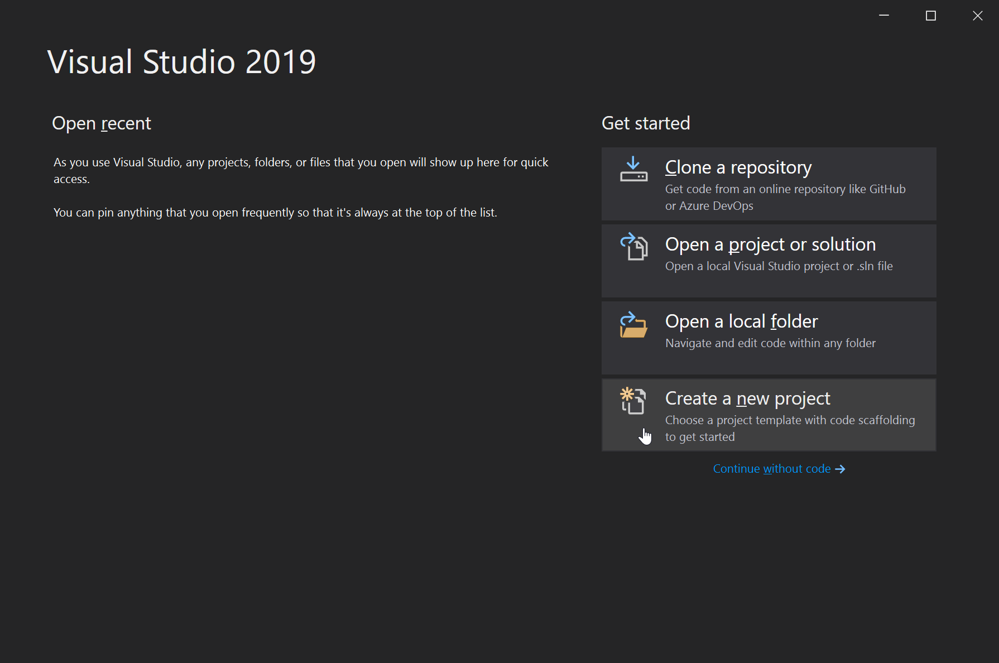
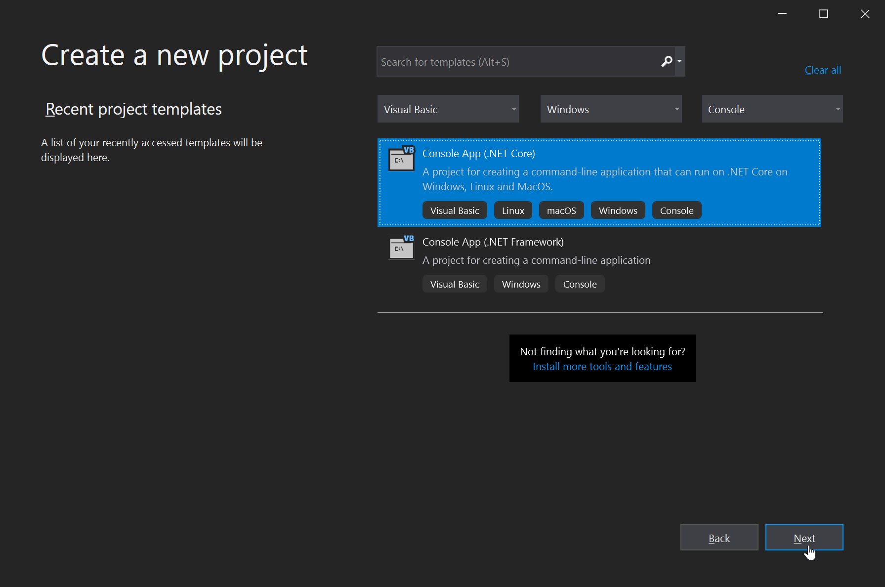
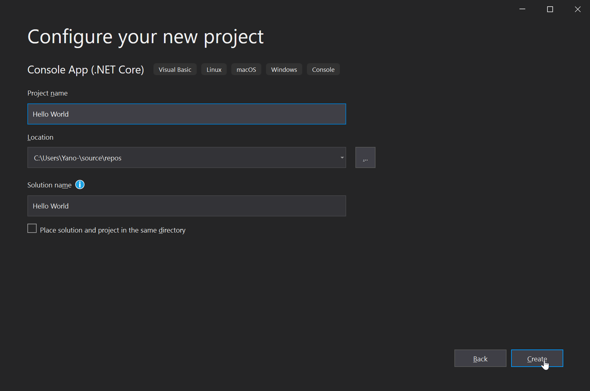
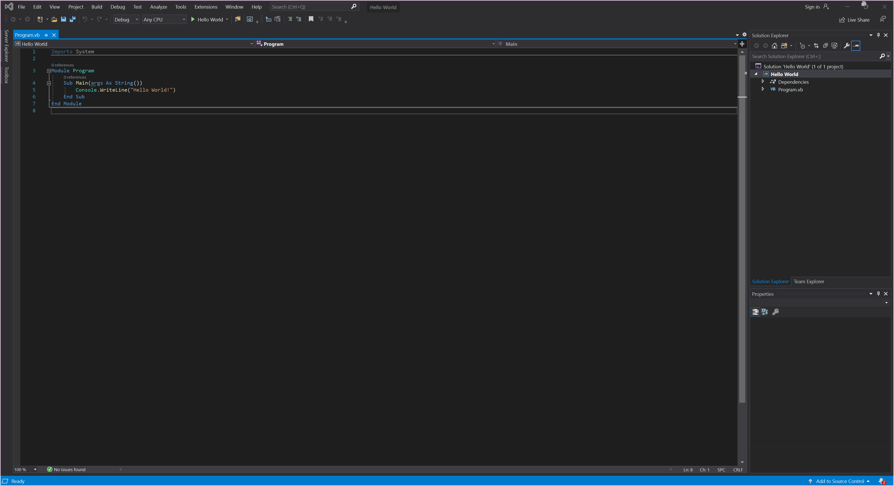

[« Go Back](....\setting-up-your-work-enviroment "Go Back")
 

# Creating Hello World

Here I will go over creating an application and showing you different parts of the GUI

### Creating the project

1. From the main menu click the create now project button
    
   
    
    
2. You will want to find and select this option by either filtering like I did, or searching.
    
   Once you have selected your project type click `Next`
    
   
3. Now name your project `Hello World` (or anything else memorable) and choose where to save it, I recomend leaving this as default. And hit `Create`
    
   
4. All done!
    
   You will have some pre-populated code appear, if you named your project the same as mine then some `Hello World!` code will also apear (A nice little easter egg)
    
   
    
    

[» Next Page (Varibles)](..\varibles "Next Page")
