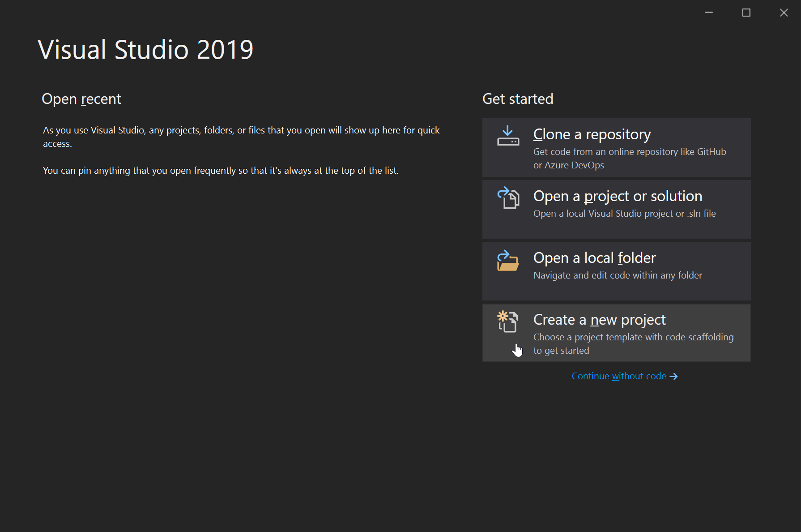
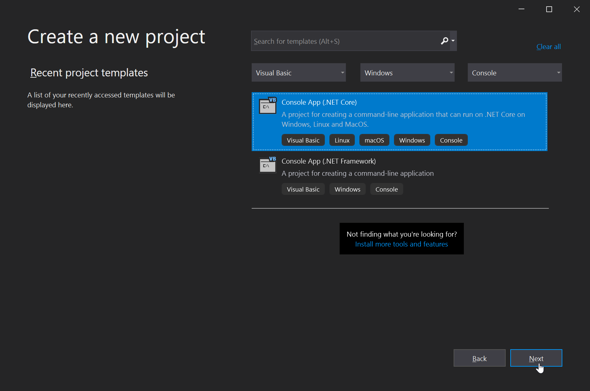
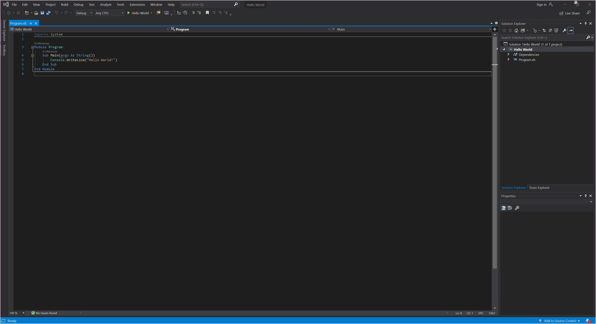

[« Go Back](\vb.net\setting-up-your-work-enviroment "Go Back")
<br/>

# Creating Hello World

Here I will go over creating a simple console application that greets you with a nice `Hello World!` message. Showing you the basics of creating a project and explaining the pre-populated code.

### Creating the project

1. From the main menu click the create now project button
   <br/>
   
   <br/>
   <br/>
2. You will want to find and select this option by either filtering like I did, or searching.
   <br/>
   Once you have selected your project type click `Next`
   <br/>
   
3. Now name your project `Hello World` (or anything else memorable) and choose where to save it, I recommend leaving this as default. And hit `Create`
   <br/>
   
4. All done!
   <br/>
   You will have some pre-populated code appear, if you named your project the same as mine then some `Hello World!` code will also apear (A nice little easter egg)
   <br/>
   
   <br/>
   <br/>
   
Lets take a closer look at the code its given us.

```vb
Imports System

Module Program
    Sub Main(args As String())
        Console.WriteLine("Hello World!")
    End Sub
End Module
```

This is a basic program that will simply print `Hello World!` to the console when run then exit. Rather simple right? Lets see how it works!

Lets start with the enclosing `Module Program` and `End Module` these define the scope of the program and where you can write code for this module. The code you want to run must be in the `Program` module by default. Then within this the Main sub is ran, subs are a way of sorting and re-using code easily. By default the `Main` sub is ran when the program starts. For now all the code you want the program to run will be inside this sub.
`Console.WriteLine("Hello World!")` is a simple line of code that tells the console to write a line with the text `"Hello World"` to the console window. Once its done this as it has nothing left to do, the program exits.

To run the program simply press F5 and it will start to compile and run it.

Now that you understand that we can move on to basic variables and how to use them!

[» Next Page (Variables)](..\variables "Next Page")
