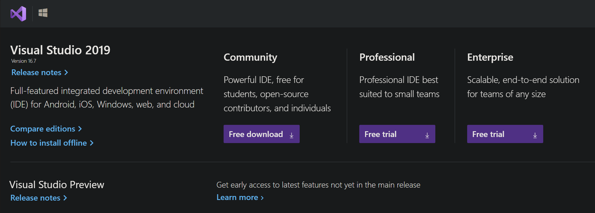
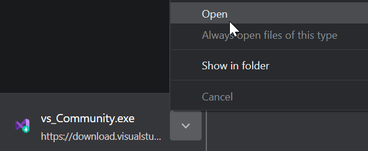
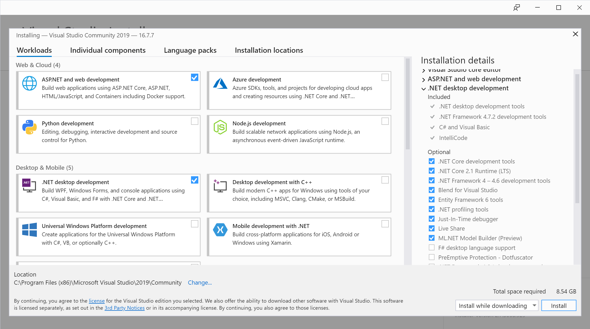

[« Go Back](\vb.net "Go Back")
 

# Setting Up Your Work Enviroment

In order to get started with Visual Basic we need to setup Visual Studio,

 

## What Is Visual Studio

Visual Studio is the IDE (Intergrated development enviroment) made by microsoft for programing in Visual Basic and many other languages. It allows users to make, edit and build there own code with many features built into the program to allow easy and quick coding. These often come in gui based menus that allow the user to easily change and edit stuff in there program without having to change code. This includes the Form Building, Properties Editor, Tool Box and many many more. Visual Studio also supports many other languages besides VB.<zws>NET, with **36** languages total.

 
 

### So lets get started and set it up!

 

1. Downloading Visual Studio
    - Download Visual Studio from [**this link**](https://visualstudio.com/downloads/), and run the installer
       
    - Which version? Well that varies a bit, but we suggest for most people you download the **Community Edition**
       
      
       
       
    - Once it has downloaded run the file.
       
      
       
       
    - Now continue through the standard installation until you get to this window, select the same options as i have bellow \(You may select other options if you require them\)
       
      And then click the `Install` button in the bottom right
      
       
       
